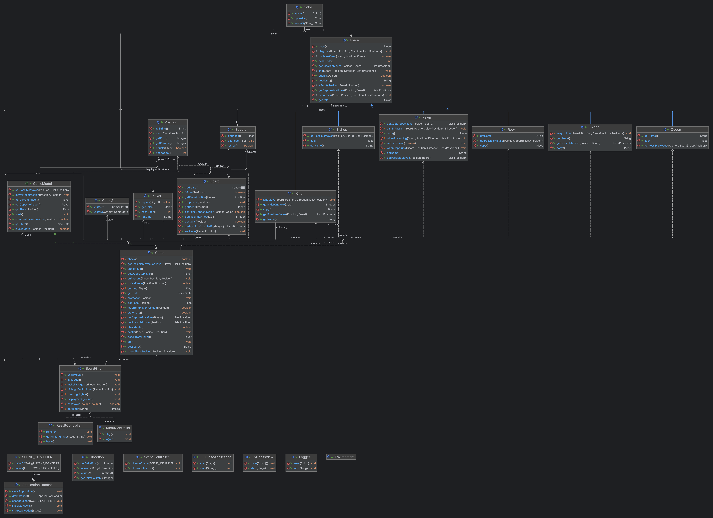

# Chess GUI Project in Java

## Introduction
This document outlines the structure of the Chess GUI project in Java. The project implements a chess game with a graphical user interface, using JavaFX for rendering the game and handling user interactions.

## Classes and Description

### Main Application
- `Application`: The primary class that launches the JavaFX application.

### Game Logic
- `Game`: Orchestrates the gameplay, maintaining the state and rules of the chess game.
- `Board`: Represents the chessboard and handles the placement and movement of pieces.
- `Square`: Represents a single square on the chessboard and may contain a piece.
- `Position`: Encapsulates the coordinates of a square on the board.

### Players
- `Player`: Abstract representation of a player in the game. It contains common attributes and behaviors for players.
- Future improvements may include AI players or online multi player capabilities.
- For now, the game only supports human players.

### Pieces
- `Piece`: An abstract class representing a generic chess piece. Specific piece types inherit from this class.
- `Pawn`, `Rook`, `Knight`, `Bishop`, `Queen`, `King`: These classes represent the specific chess pieces and define their movement and capture logic.

### Utilities
- `Color`: An enumeration defining the two possible colors of chess pieces and players (white and black).
- `Direction`: An enumeration defining directions that can be used for piece movement logic.
- `GameState`: An enumeration that represents the possible states of the game (play, check, checkmate, stalemate).

### Controllers
- `MenuController`: Manages the game menu.
- `SceneController`: Manages different scenes within the JavaFX application.
- `ResultController`: Manages the result screen that is displayed when the game ends.

### Views
- `BoardView`: Displays the chessboard and pieces on the screen and handles user interactions, also handles the highlighting of squares.

## Interaction Flow
1. The `Application` class initializes the JavaFX application and sets up the primary stage.
2. `BoardController` is responsible for managing the `Game` logic and updating the Board.
3. User moves are processed by the `BoardController`, which then updates the `Game` state.
4. The `SceneController` manages transitions between different scenes, like the game board and menus.
5. `Logger` captures important events and errors throughout the application lifecycle.
6. `Board` class handles the placement and movement of pieces on the board.
7. `Piece` classes define the movement and capture logic for each piece type.
8. `Player` classes define the behavior of players in the game.


## Class Diagram
The following diagram shows the class structure of the Chess GUI project, this diagram was generated using IntelliJ IDEA.



## Requirements
- Java 8 or higher
- JavaFX 8 or higher
- Maven 3.6.3 or higher

## Running the Application
The application can be run from the command line using the following command:
```
java -jar ChessGUI.jar
```

## Screenshots
The following screenshots show the game in action. 


## Conclusion
This Chess GUI project implements a complete chess game with support only for human players. The class structure is designed to be modular and expandable for future enhancements such as AI players or online multiplayer capabilities.


